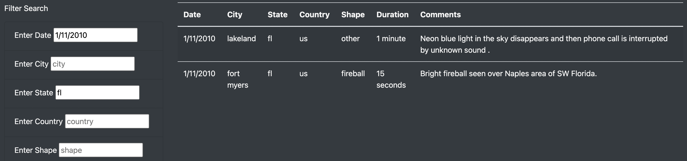

# UFOs

*Prepared for Dana - 2021MAR14*

## Overview of Project

* The aim of this project is to develop a practical and easy-to-use web tool that allows the user to refine their UFO sighting search based on date, place (city, state, country) and/or type. 

## Results

### User Instructions

The following is a breakdown of the steps that a user would take in order to properly utilize the web application:

* Enter search criteria in the date, city, state, country, and/or type to filter out the data in the table
* Refine your search further by increasing the number of search criteria fields you fill
* Hit the **enter** button to show the filtered table of results

### Example

The following data was entered and obtained 2 results:

* Date: **1/11/2010**
* State: **fl**

## Summary

### Drawback

One major drawback of this design is that a user can only select *one* entry for each of the filter types, however this flaw is addressed in the following section (recommendations for further development)

### Recommendations for Further Development

Several recommendations for further development of this web application include the following:

* Enhancing the filter selection to include multiple entries for the same filter type (ie. can select more than one type or multiple cities when refining search, and therefore not limited to just one type or one city per search)
* Provide real-time and up-to-date inclusion of UFO sightings with the utilization of web scraping
